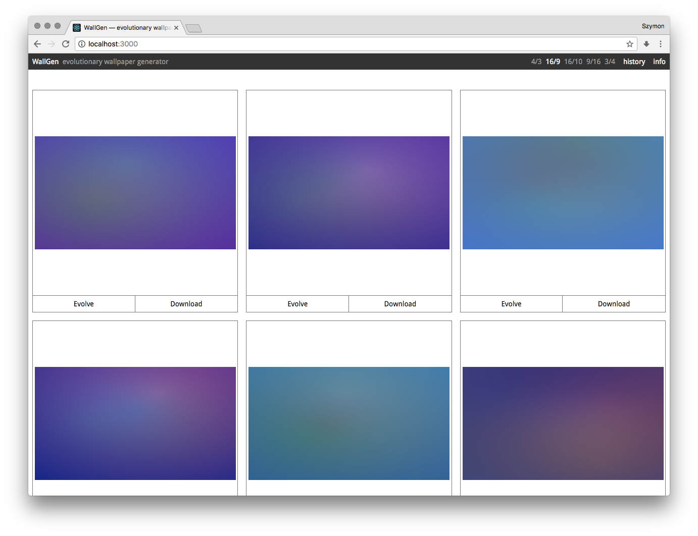

# WallGen

## Evolutionary wallpaper generator

Live: [http://szymonkaliski.github.io/wallgen](http://szymonkaliski.github.io/wallgen)

Made with [react](https://facebook.github.io/react/), [react-gl](https://github.com/gre/gl-react), [redux](https://github.com/reactjs/redux) and [immutable](https://facebook.github.io/immutable-js/).

Features evolutionary algorithm running in webworker on immutable data, and awesome GLSL-based transitions between wallpapers.

## Run

1. clone this repo
2. `yarn` or `npm install`
3. `yarn run start` or `npm start`

## Build

1. `yarn run build` or `npm run build`

